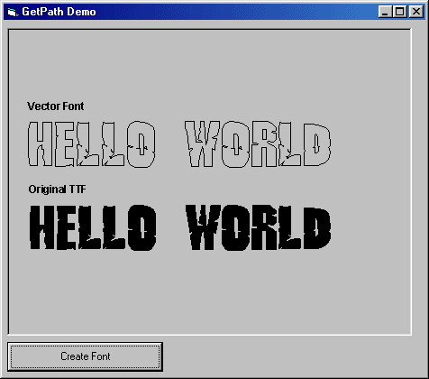



## Create Vector from TTF Font

### Description

Simple Demo how to create a VectorFont from any TrueType Font using GetPath "gdi" Api. Now u can use the vectors for 3D.....
 
### More Info
 

             |
---                |---
**Submitted On**   |2003-03-07 14:36:04
**By**             |[Scythe](https://github.com/Planet-Source-Code/PSCIndex/blob/master/ByAuthor/scythe.md)
**Level**          |Intermediate
**User Rating**    |5.0 (35 globes from 7 users)
**Compatibility**  |VB 5\.0, VB 6\.0
**Category**       |[Graphics](https://github.com/Planet-Source-Code/PSCIndex/blob/master/ByCategory/graphics__1-46.md)
**World**          |[Visual Basic](https://github.com/Planet-Source-Code/PSCIndex/blob/master/ByWorld/visual-basic.md)
**Archive File**   |[Create\_Vec155596372003\.zip](https://github.com/Planet-Source-Code/scythe-create-vector-from-ttf-font__1-43816/archive/master.zip)

